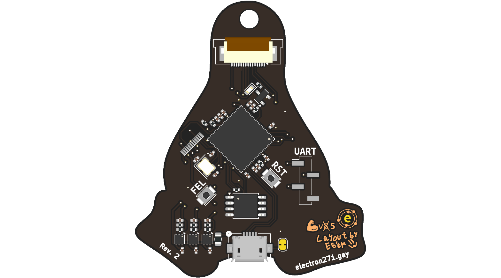
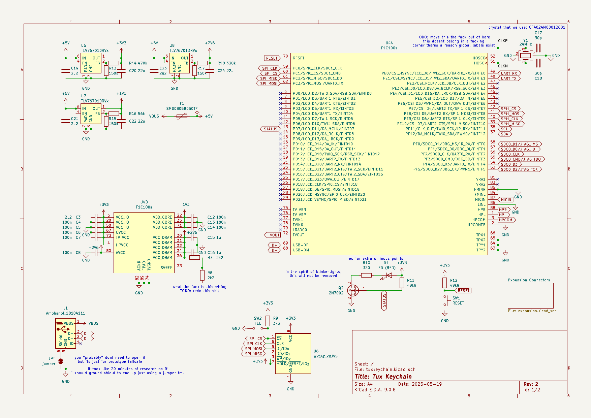

# Tux Keychain
Keychain shaped like Tux, the Linux mascot. But it's not just a keychain, it runs embedded Linux!

Unfortunately this is more expensive than usual due to tariffs and inflation. (Probably cheaper in other countries.)

**This project is not made by the All Things Linux 501(c)(3) organization. This project is made by All Things Linux staff members.**

NOTE: This is still in the prototype stage, changes to the design are likely.

## Manufacturing
- This is a 4-layer PCB so it can fit in the Tux keychain form factor.
- Make sure you use ENIG for the PCB finish, else Tux will be gray instead of gold. (If you want a gray Tux, seek help.)
- This is designed for JLCPCBs assembly service, some parts are LCSC exclusive*.

*You can probably find them on other chinese distributors, but I don't know which ones.

## Attribution
The Allwinner F1C100s footprint/symbol is from https://github.com/thirtythreeforty/3340_kicad (F1C100s symbol, QFN-88_EP_10x10_Pitch0.4mm footprint).
Same for the JW5211 symbol and footprint.

Schematic heavily based on the business card design by thirtythreeforty (https://www.thirtythreeforty.net/posts/2019/12/my-business-card-runs-linux/businesscard.pdf).

Tux attribution: [lewing@isc.tamu.edu](https://isc.tamu.edu/~lewing/linux/) (Larry Ewing) and [The GIMP](https://www.gimp.org/).

## Images
> [!NOTE]
> These are auto-generated and will always be up to date (GitHub cache may make them seem out of date)

|PCB|Schematic|
|---|---|
|||
|||  
